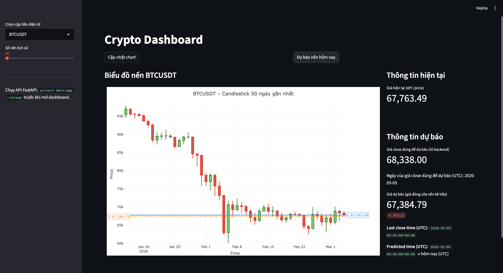
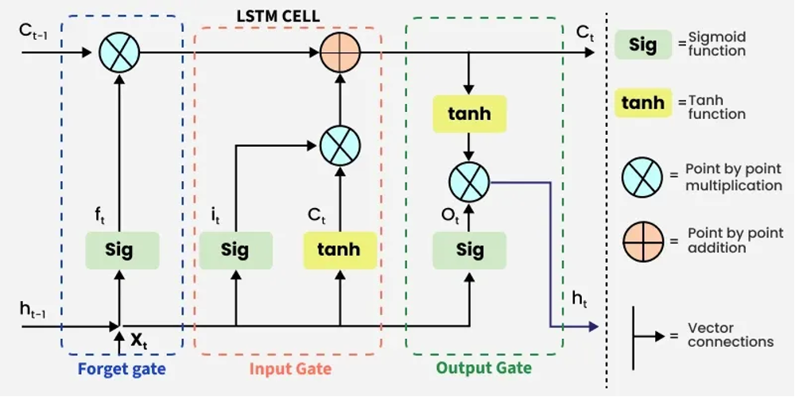

# 🪙 Crypto LSTM Dashboard

Dự án dự báo giá tiền điện tử (BTC, ETH) sử dụng mô hình **LSTM (Long Short-Term Memory)** kết hợp với dữ liệu thời gian thực từ **Binance API**, được trực quan hóa qua **Streamlit Dashboard**.

---

## 📌 Tổng quan

Hệ thống gồm hai thành phần chính:
- **FastAPI Backend** (`main.py`): Cung cấp API lấy dữ liệu, dự báo giá và WebSocket giá thời gian thực.
- **Streamlit Frontend** (`dashboard.py`): Giao diện dashboard tương tác hiển thị biểu đồ nến, kết quả dự báo và giá live.



---

## 🔄 Quy trình dự án

### 1️⃣ Thu thập dữ liệu

📁 **`Get_data/`**

- Dữ liệu lịch sử giá BTC/USDT và ETH/USDT khung thời gian **1 ngày** được tải từ Binance.
- Lưu tại: `Get_data/data/BTCUSDT_1d.csv`, `Get_data/data/ETHUSDT_1d.csv`
- Các cột dữ liệu gồm: `open`, `high`, `low`, `close`, `volume`, `open_time`, `close_time`,...

---

### 2️⃣ Làm sạch dữ liệu (EDA)

📁 **`eda/`**

- Notebook `eda.ipynb` thực hiện khám phá và làm sạch dữ liệu:
  - Kiểm tra và xử lý giá trị thiếu (NaN)
  - Loại bỏ ngoại lệ
  - Chuẩn hóa định dạng thời gian
- Kết quả: `eda/BTCUSDT_1d_cleaned.csv`, `eda/ETHUSDT_1d_cleaned.csv`

---

### 3️⃣ Feature Engineering (Trích xuất đặc trưng)

📁 **`feature_engineering/`**

- Notebook `fe.ipynb` tính toán các đặc trưng kỹ thuật:

| Feature | Mô tả |
|--------|-------|
| `open` | Giá mở cửa |
| `high` | Giá cao nhất |
| `low` | Giá thấp nhất |
| `volume` | Khối lượng giao dịch |
| `rsi` | RSI 14 ngày (Relative Strength Index) |
| `pct_change` | Phần trăm thay đổi giá so với ngày trước |

- Kết quả: `feature_engineering/BTCUSDT_1d_fe.csv`, `feature_engineering/ETHUSDT_1d_fe.csv`

---

### 4️⃣ Xây dựng & Huấn luyện mô hình LSTM

📁 **`model_lstm/`**



#### Kiến trúc mô hình

```python
LSTMModel(
    input_size  = 6,     # 6 features
    hidden_size = 256,   # 256 units ẩn
    num_layers  = 2,     # 2 lớp LSTM
    output_size = 1,     # Dự báo giá close ngày tiếp theo
    dropout     = 0.4
)
```

#### Quy trình huấn luyện

- **Chuẩn hóa dữ liệu**: Dùng `StandardScaler` riêng cho `X` (features) và `y` (giá close)
- **Sequence length**: 30 ngày (mỗi mẫu đầu vào là chuỗi 30 nến liên tiếp)
- **Loss function**: MSE (Mean Squared Error)
- **Optimizer**: Adam (`lr=1e-3`)
- **Lưu model tốt nhất**: `best_model_btc.pth`, `best_model_eth.pth`
- **Lưu scaler**: `scaler_X_BTC.pkl`, `scaler_y_BTC.pkl`, `scaler_X_ETH.pkl`, `scaler_y_ETH.pkl`

#### Notebooks huấn luyện
- `Train_LSTM_BTC.ipynb` — Huấn luyện mô hình BTC
- `Train_LSTM_ETH.ipynb` — Huấn luyện mô hình ETH

---

### 5️⃣ Backend API (FastAPI)

📄 **`main.py`**

| Endpoint | Phương thức | Mô tả |
|----------|------------|-------|
| `/` | GET | Kiểm tra API hoạt động |
| `/predict/{symbol}` | GET | Dự báo giá ngày tiếp theo |
| `/history/{symbol}` | GET | Lấy lịch sử nến OHLCV |
| `/price/{symbol}` | GET | Giá hiện tại từ Binance |
| `/debug_input/{symbol}` | GET | Xem dữ liệu input LSTM (debug) |
| `/ws/price/{symbol}` | WebSocket | Stream giá real-time mỗi 2 giây |

#### Quy trình dự báo

```
Binance API (90 ngày gần nhất)
        ↓
Lọc nến đã đóng (close_time ≤ now)
        ↓
Tính RSI-14 & pct_change
        ↓
Lấy 30 nến gần nhất → StandardScaler (scaler_X)
        ↓
LSTM Model → dự báo giá đã scale
        ↓
inverse_transform (scaler_y) → giá dự báo thực
```

---

### 6️⃣ Frontend Dashboard (Streamlit)

📄 **`dashboard.py`**

- **Chọn cặp tiền**: BTC/USDT hoặc ETH/USDT
- **Biểu đồ nến** (Candlestick chart) tương tác với Plotly
- **Kết quả dự báo**: Giá close cuối, giá dự báo ngày mai, thời gian dự báo
- **Giá Live**: Cập nhật thời gian thực qua WebSocket

---

## 🚀 Hướng dẫn chạy dự án

### Yêu cầu

```bash
pip install fastapi uvicorn streamlit plotly pandas pandas_ta torch joblib python-binance requests
```

### Cấu hình API Key Binance

```bash
export BINANCE_API_KEY="your_api_key"
export BINANCE_API_SECRET="your_api_secret"
```

### Khởi chạy Backend

```bash
uvicorn main:app --reload
```

### Khởi chạy Dashboard

```bash
streamlit run dashboard.py
```

> ⚠️ Phải chạy **Backend trước**, sau đó mới chạy Dashboard.

---

## 📁 Cấu trúc thư mục

```
Crypto_dashboard_predict/
├── main.py                  # FastAPI backend
├── dashboard.py             # Streamlit frontend
├── backup.py                # Bản backup main.py
├── Get_data/                # Thu thập dữ liệu lịch sử
│   ├── Get_data_historical.ipynb
│   └── data/
│       ├── BTCUSDT_1d.csv
│       └── ETHUSDT_1d.csv
├── eda/                     # Khám phá & làm sạch dữ liệu
│   ├── eda.ipynb
│   ├── BTCUSDT_1d_cleaned.csv
│   └── ETHUSDT_1d_cleaned.csv
├── feature_engineering/     # Trích xuất đặc trưng
│   ├── fe.ipynb
│   ├── BTCUSDT_1d_fe.csv
│   └── ETHUSDT_1d_fe.csv
├── model_lstm/              # Huấn luyện & lưu mô hình
│   ├── Train_LSTM_BTC.ipynb
│   ├── Train_LSTM_ETH.ipynb
│   ├── best_model_btc.pth
│   └── best_model_eth.pth
├── pic/                     # Hình ảnh minh họa
│   ├── giaodien1.png
│   └── LSTM.png
└── Test/                    # Thư mục thử nghiệm
```

---

## ⚙️ Công nghệ sử dụng

| Thành phần | Công nghệ |
|-----------|-----------|
| Mô hình AI | PyTorch LSTM |
| Backend API | FastAPI + Uvicorn |
| Frontend | Streamlit + Plotly |
| Dữ liệu | Binance API |
| Feature Engineering | pandas-ta (RSI) |
| Chuẩn hóa | scikit-learn StandardScaler |

---

## 📊 Luồng dữ liệu tổng thể

```
Binance Historical Data
        ↓
   EDA & Cleaning
        ↓
 Feature Engineering
  (RSI, pct_change)
        ↓
  LSTM Training
  (30-day sequence)
        ↓
  Save Model & Scaler
        ↓
  FastAPI Backend  ←── Binance Real-time
        ↓
 Streamlit Dashboard
```

---

> 📝 **Lưu ý**: Dự án chỉ mang tính học thuật và nghiên cứu. Kết quả dự báo **không phải** lời khuyên đầu tư tài chính.